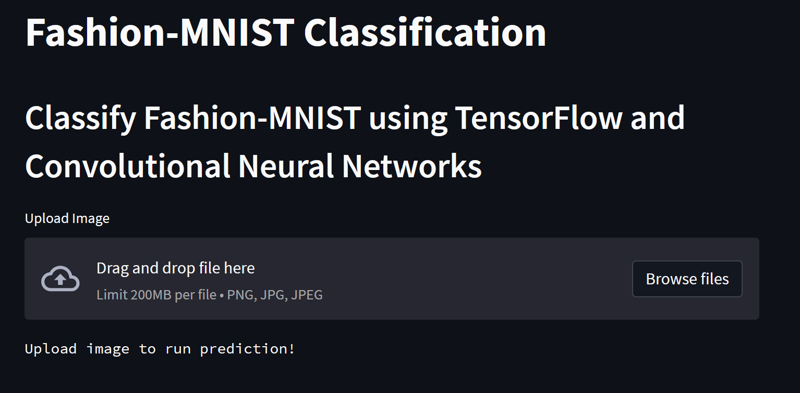
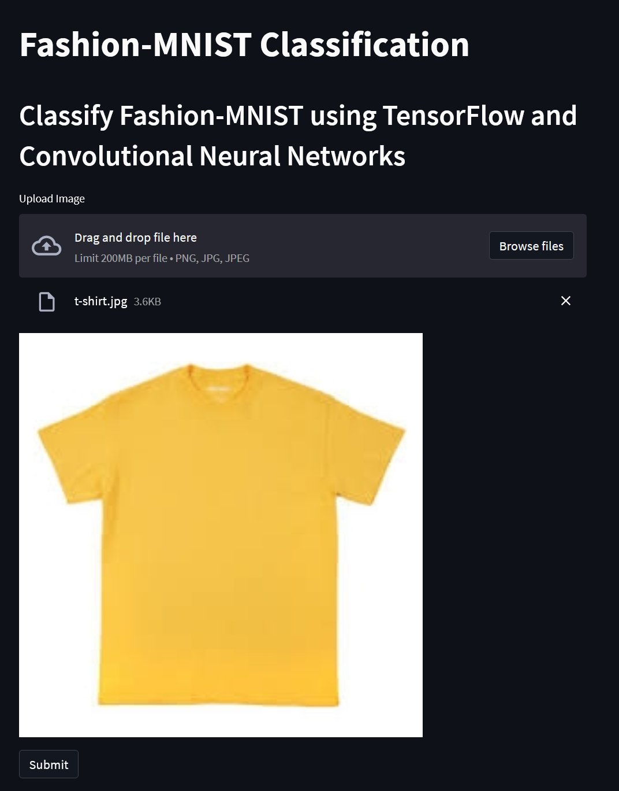
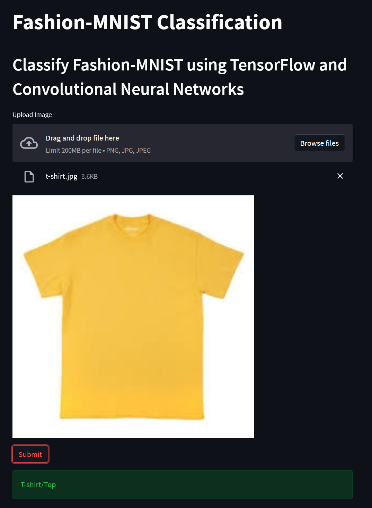

# Ainize Fashion MNIST Frontend

Frontend for Fashion MNIST using the Ainizer platform

This is the frontend server for the project. You can view the backend repo by going [here](https://github.com/nelsen129/ainize-fashion-mnist)

## Intro

Fashion MNIST is a dataset containing 70,000 28x28px grayscale images of items of clothing and accessories, such as 
t-shirts, sneakers, and bags. This demo uses a trained model using convolutional neural networks (CNNs) as well as
various data augmentation techniques to classify a given input image into a fashion category

You can find the dataset for Fashion MNIST [here](https://github.com/zalandoresearch/fashion-mnist)

## Demo

You can find the demo [here](https://main-ainize-fashion-mnist-frontend-nelsen129.endpoint.ainize.ai/)

In the demo, you should see a screen like this

After uploading any fashion image, you should see the `Submit` button to predict the class

After hitting submit, you should see the class of your prediction!

For best results, I advise using a picture with a clear background and with the item clearly in focus. However, I would 
also recommend trying to upload images that won't work so you can see the limitations of the model!